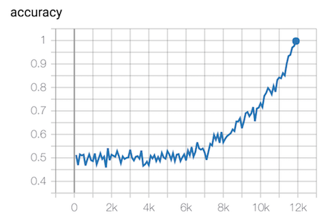

My deep learning code snippets. 

Examples: 
- Incremental Network Quantization
   - Code can be found in densenet/inq/.
   - I'm able to achieve 79% test accuracy on CIFAR100 after quantization with the training setup in `densenet/quantize.py`.
- [DenseNet](densenet/densenet.py) and [MobileNetV2](densenet/mobilenetv2.py)
    - Use [train.py](densenet/train.py) to train either networks.
    - I'm able to achieve 80.22% test accuracy on CIFAR100 with densenet with the training setup in `train.py`.
- [My solution to XOR parity challenge](xor_parity.py)
    - This is the "warmup" from [OpenAI request for research v2](https://blog.openai.com/requests-for-research-2/)
    
    
- [RNN that predicts Shakespeare verse](rnn.py) (replicating [this tensorflow tutorial](https://www.tensorflow.org/tutorials/sequences/text_generation) with `Estimator` APIs, also added LSTM as a model choice)
    - Generated Shakepeare after 1000 steps of training on GRU:
     
        ```
        ROMEO:
        No, I shall be the father, that I say,
        The sense of the procled will be the seas.

        LADY ANNE:
        What says the seast that we say 'tis a thing and like to see him for the people,
        Which was the seas of t
        ```
- Demonstrate accelerated learning from batch normalization on mnist: see `batch_norm.py`
    - 
